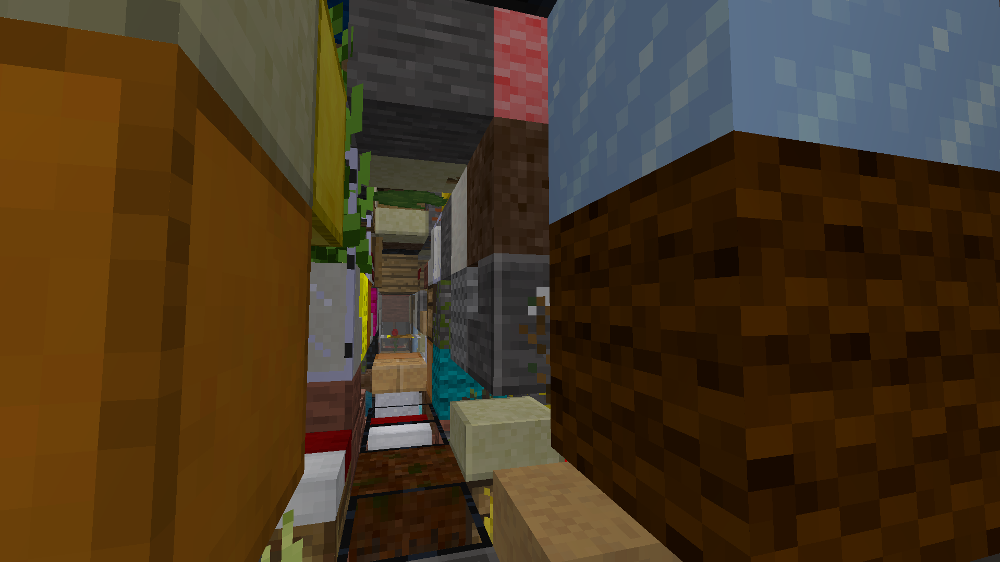
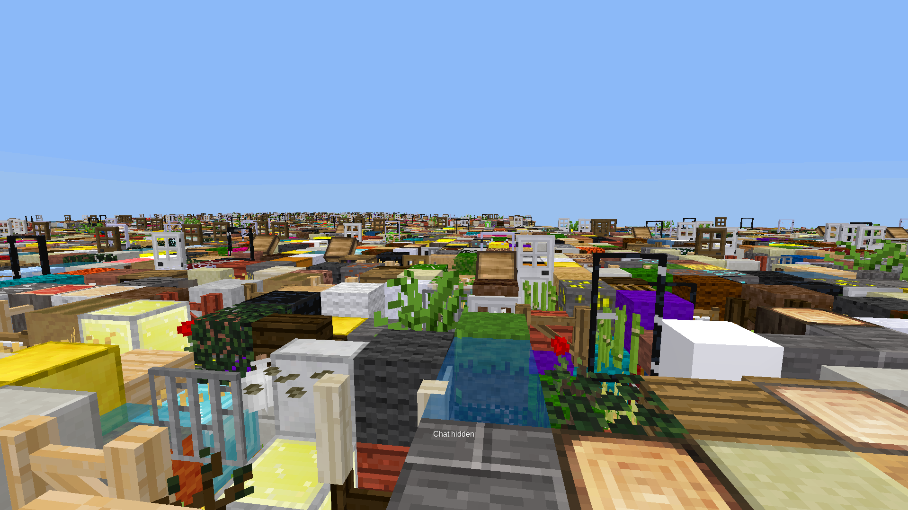

# random block gen

Generates world by randomly picking blocks

## Configuration options:

At the top of the `init.lua` file, the following options can be changed:

MIN (default: 10000) -- minimum height after which to generate

MAX (default: 20000) -- maximum height before which to generate

DEBUG (default: false) -- enable debug messages

groups_ignore -- groups to ignore, (by default used to avoid lag with fire and tnt)

## Screenshots:

